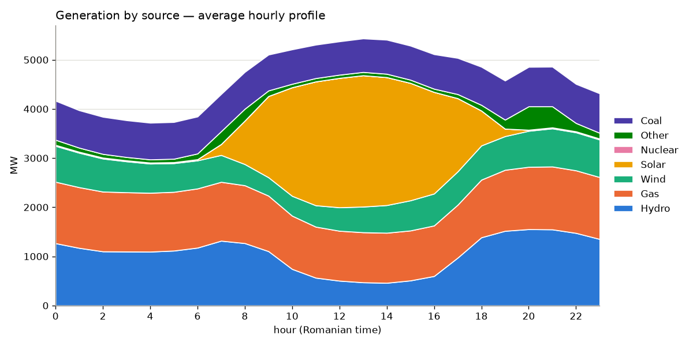
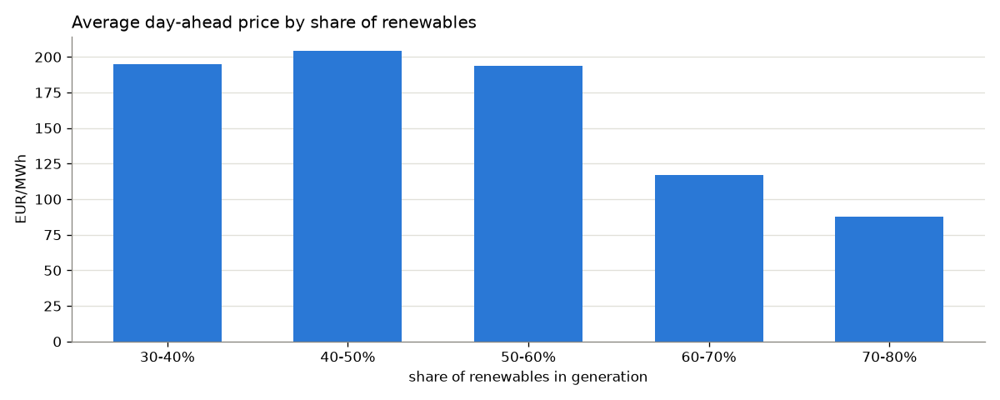
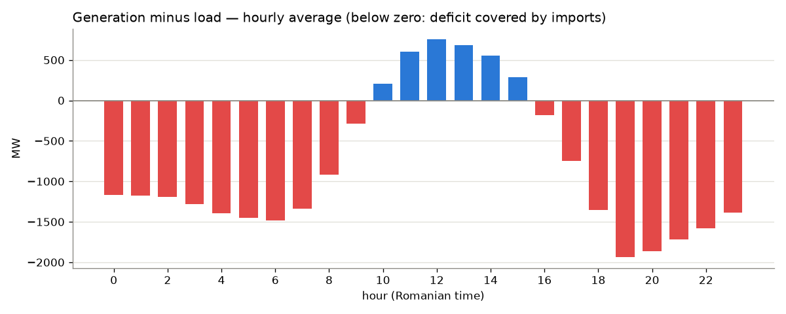

# Energy Data Pipeline — ENTSO-E

[](https://github.com/ionutcal/energy-pipeline/actions/workflows/tests.yml)

An automated pipeline that collects data about the European power system
(load, generation, day-ahead prices) from the ENTSO-E Transparency Platform,
stores it in PostgreSQL and produces analyses.

It runs on a schedule, is idempotent (a repeated run doesn't duplicate data)
and downloads incrementally, fetching only what is missing.

## Key findings

Romania, 16 August – 15 September 2026: 30 days at 15-minute resolution,
from the ENTSO-E Transparency Platform. Hours are Romanian local time.

**Solar reshapes the day.** Renewables supplied 57% of generation on an
average day (between 51% and 63%). Gas (25%), hydro (23%) and solar (20%)
were the largest sources, followed by coal (16%) and wind (13%). Nuclear was
reported at 0 MW for the whole period.



**More renewables, lower prices.** The day-ahead price averaged around
200 EUR/MWh while renewables stayed below 60% of generation, then fell to
117 EUR/MWh at 60–70% and 88 EUR/MWh above 70% (correlation −0.59).
Weekends were cheaper too: 133 EUR/MWh versus 180 EUR/MWh on weekdays.



**A midday surplus, an evening deficit.** Generation exceeded load only
between 10:00 and 16:00, when solar peaks. For 76% of the time Romania
generated less than it consumed, with the largest gap — about 1,900 MW —
around 19:00, as solar fades while demand is still high.



These are observations over one month, not causal claims: the price link
also reflects time of day and demand, which move together with solar
output. The charts come from `python -m src.report`; see
[Generated analyses](#generated-analyses) for how each figure is computed.

## Architecture

```
ENTSO-E API ──> fetch.py ──> transform.py ──> db.py ──> PostgreSQL
                (retry)      (cleaning +      (idempotent
                             checks)          upsert)
                                                 │
                                            report.py ──> analyses + charts
```

Each module has a single responsibility, and `transform.py` touches neither
the network nor the database — which is why it can be tested directly.

### Database schema

A single table in "long" format (one observation per row):

| column | description |
|---|---|
| `country` | ISO code (e.g. `RO`) |
| `metric` | `load_actual`, `price_day_ahead`, `generation_actual` |
| `psr_type` | resource type for generation (wind, solar…); empty otherwise |
| `ts` | observation timestamp (UTC) |
| `value` | measured value |
| `unit` | `MW`, `EUR/MWh` |
| `ingested_at` | when the row was ingested |

Unique constraint on `(country, metric, psr_type, ts)` — this natural key is
what makes the upsert idempotent.

Why long format instead of one column per metric: metrics have different
dimensions (generation has a fuel type, price has a currency), and adding a
new metric doesn't require a table migration.

### Implementation decisions

- **Watermark, not a full re-download** — the pipeline reads the latest `ts`
  from the database and only requests the interval after it, with one day of
  overlap for data published late or revised. Day-ahead prices are published
  in advance, so for them the next day is requested as well.
- **True upsert** — a stored value is updated if the API sends it changed; a
  repeated run over the same data writes nothing.
- **Backfill on the first run** — if the table is empty, the last
  `BACKFILL_DAYS` days are downloaded.
- **Error isolation** — one failing metric doesn't stop the rest of the run;
  the exit code signals whether any failures occurred.
- **Retry with exponential backoff** for network errors.
- **Quality checks** — gaps in the series (at the step inferred from the
  data), negative values, IQR outliers (robust to skewed distributions such
  as prices), computed separately for each resource type.
- **Chunked inserts** — PostgreSQL accepts at most 65535 parameters per
  statement, and a 30-day backfill exceeds that limit.

## Installation

### Requirements

- Docker, or Python 3.12+ and PostgreSQL 14+
- An ENTSO-E API token (free)

### Getting a token

1. Create an account at <https://transparency.entsoe.eu/>
2. Email `transparency@entsoe.eu` with the subject `RESTful API access` and
   the address you registered with in the body
3. Once approved, generate the token from your account settings

Approval takes a few business days.

### Running with Docker

```bash
cp .env.example .env      # fill in ENTSOE_API_KEY, DB_USER, DB_PASS, DB_NAME
docker compose up --build
```

### Running manually

```bash
python -m venv venv && source venv/bin/activate
pip install -r requirements.txt
cp .env.example .env      # fill in the values
python -m src.pipeline    # collect the data
python -m src.report      # generate analyses and charts into output/
```

To try it without PostgreSQL, point it at SQLite:

```bash
DATABASE_URL="sqlite:///energy.db" python -m src.pipeline
DATABASE_URL="sqlite:///energy.db" python -m src.report
```

### Scheduled runs

```bash
crontab -e
# daily at 06:00
0 6 * * * /path/to/project/scripts/run_daily.sh
```

## Demo without a token

To try the flow without waiting for API approval, `seed_demo.py` fills the
database with synthetic data that has realistic daily and weekly patterns
(load, price and generation by source):

```bash
DATABASE_URL="sqlite:///demo.db" python seed_demo.py
DATABASE_URL="sqlite:///demo.db" python -m src.report
```

## Tests

```bash
pytest tests/ -v
```

The tests cover data normalization (including restoring A03 curves), quality
checks, the fetch window, the upsert, full pipeline runs against a faked API
and the report analyses. No ENTSO-E token is needed.

By default they run on in-memory SQLite. The upsert has database-specific
code, so on every push GitHub Actions runs the suite twice: on SQLite and on
PostgreSQL 16. To run against PostgreSQL locally:

```bash
TEST_DATABASE_URL="postgresql+psycopg2://postgres@localhost:5432/energy_test" pytest tests/ -v
```

## Generated analyses

Hours and days are in Romanian local time; incomplete days at either end of
the interval are excluded from daily series.

**Load and price**
- hourly profile (morning and evening peaks)
- weekdays vs. weekend
- daily trend

**Generation mix**
- each source's share of the energy generated (hydro, gas, solar, coal, wind,
  nuclear, other)
- average hourly profile, stacked by source
- daily share of renewables, weighted by energy
- average day-ahead price by share of renewables, with the correlation
- generation minus load by hour — when Romania is in deficit and covers it
  with imports (an approximation: reported load and generation don't cover
  exactly the same installations)

## What the API actually returns

Confirmed with `check_api.py` on `python-entsoe` 0.6.1, for `RO`:

| metric | columns | unit |
|---|---|---|
| `load_actual` | `timestamp, value, quantity_unit` | `MAW` |
| `price_day_ahead` | `timestamp, value, currency, price_unit` | `EUR` + `MWH` |
| `generation_actual` | `timestamp, psr_type, value, quantity_unit` | `MAW` |

Four things worth knowing, because each has consequences in the code:

- **Series arrive compressed (`curveType` A03)**: a point is only sent when
  the value changes, and `python-entsoe` doesn't restore the omitted
  positions. Without restoring them, a whole night of solar shows up as a
  single `0` and nuclear as one point per day — over 30 days, more than a
  third of the generation values were missing. `transform.expand_block_curve`
  fills them in.
- **Resolution is 15 minutes**, not hourly. The gap check infers the step
  from the data (`transform.infer_step`) instead of assuming it.
- **Units are UN/CEFACT codes** (`MAW` = megawatt). They are read from the
  response and mapped to the usual notation, rather than taken from a
  constant in the code.
- **`psr_type` mixes names and raw codes**: `python-entsoe` only translates
  B01–B20, so `B25` (Energy storage) stays a code. Since `psr_type` is part
  of the natural key, a change to the package's translation table would
  create parallel rows for the same resource.

## Known limitations

- The tail of an A03 series is filled up to the last timestamp in the
  response, because the package doesn't keep the period end. The provisional
  value is corrected on the next run.
- Negative prices are normal in the day-ahead market, but the quality check
  counts them the same way for every metric.
