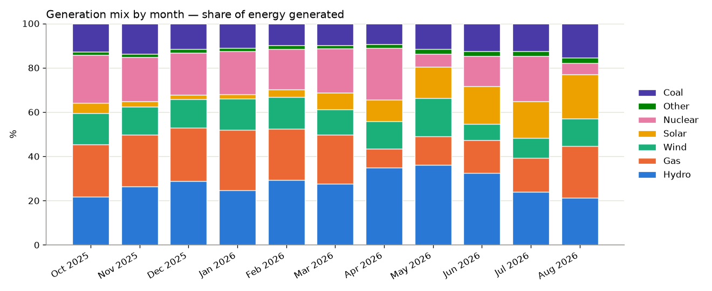
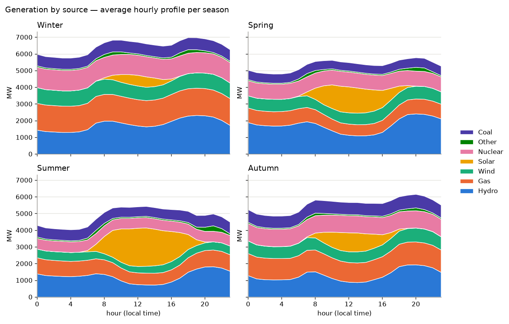
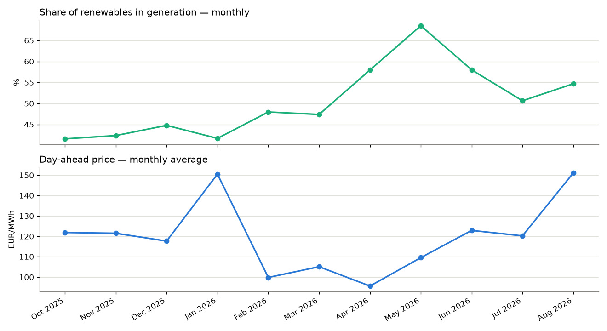

# Energy Data Pipeline — ENTSO-E

[](https://github.com/ionutcal/energy-pipeline/actions/workflows/tests.yml)

An automated pipeline that collects data about the European power system
(load, generation, day-ahead prices) from the ENTSO-E Transparency Platform,
stores it in PostgreSQL and produces analyses.

It runs on a schedule, is idempotent (a repeated run doesn't duplicate data)
and downloads incrementally, fetching only what is missing.

## Key findings

Romania, 12 months (15 September 2025 – 15 September 2026) at 15-minute
resolution, from the ENTSO-E Transparency Platform. Monthly figures use the 11
complete months, October 2025 – August 2026. Hours are local time.

**The generation mix changes a lot through the year.** Over the year, hydro
supplied 27% of the energy generated, gas 21%, nuclear 17%, wind 13%, coal 12%
and solar 9%. Renewables averaged 50% of generation per day, from 30% on
21 December 2025 to 83% on 24 May 2026. Solar grows from about 2% of monthly
generation in December and January to 20% in August. In spring, hydro and
solar peak together, and renewables reached 69% of generation in May.





**Nuclear isn't always there.** Nuclear normally runs at about 1,100 MW,
around a fifth of generation, but it was near zero on 53 days: in May–June and
again from mid-August 2026.

**Renewables and prices are linked more weakly than a single month suggests.**
In one summer month, the correlation between the share of renewables and the
day-ahead price was −0.59. Over the full year it is −0.18, and it depends on
the season: −0.41 in summer, −0.16 in spring, and close to zero in winter
(−0.07) and autumn (+0.09). Monthly averages show why a single month can
mislead. January was expensive (151 EUR/MWh) with 42% renewables, and August
was just as expensive (151 EUR/MWh) with 55%, while April was the cheapest
month (96 EUR/MWh) with 58%.



The link does show at the extremes. At 80–90% renewables, the average price
was 55 EUR/MWh. Prices went negative on 40 days, 173 hours in total, all from
February to September. Weekends were cheaper than weekdays: 94 versus
132 EUR/MWh.


**A midday surplus and an evening deficit.** On average, generation exceeded
load only between 10:00 and 15:00. Romania generated less than it consumed 68%
of the time, with the largest average gap, about 1,200 MW, around 20:00.

**Neighbouring markets.** Bulgaria cleared at exactly the same day-ahead price
as Romania 75% of the time. Hungary did so only 14% of the time, with a mean
difference of 7 EUR/MWh.

These are observations, not causes. Prices also depend on demand, fuel costs,
imports and time of day, all of which move with the seasons. The charts come
from `python -m src.report` run on one year of data (`BACKFILL_DAYS=365`); see
[Generated analyses](#generated-analyses) for how each figure is computed.

## Architecture

```
ENTSO-E API ──> fetch.py ──> transform.py ──> db.py ──> PostgreSQL
                (retry)      (cleaning +      (idempotent
                             checks)          upsert)
                                                 │
                                            report.py ──> analyses + charts
```

Each module has a single responsibility, and `transform.py` touches neither
the network nor the database — which is why it can be tested directly.

### Database schema

A single table in "long" format (one observation per row):

| column | description |
|---|---|
| `country` | ISO code (e.g. `RO`) |
| `metric` | `load_actual`, `price_day_ahead`, `generation_actual` |
| `psr_type` | ENTSO-E resource type code for generation (`B16` = Solar, `B04` = Gas…, see `src/psr.py`); empty otherwise |
| `ts` | observation timestamp (UTC) |
| `value` | measured value |
| `unit` | `MW`, `EUR/MWh` |
| `ingested_at` | when the row was ingested |

Unique constraint on `(country, metric, psr_type, ts)` — this natural key is
what makes the upsert idempotent.

Why long format instead of one column per metric: metrics have different
dimensions (generation has a fuel type, price has a currency), and adding a
new metric doesn't require a table migration.

### Implementation decisions

- **Watermark, not a full re-download** — the pipeline reads the latest `ts`
  from the database and only requests the interval after it, with one day of
  overlap for data published late or revised. Day-ahead prices are published
  in advance, so for them the next day is requested as well.
- **True upsert** — a stored value is updated if the API sends it changed; a
  repeated run over the same data writes nothing.
- **Backfill on the first run** — if the table is empty, the last
  `BACKFILL_DAYS` days are downloaded.
- **Error isolation** — one failing metric doesn't stop the rest of the run;
  the exit code signals whether any failures occurred.
- **Retry with exponential backoff** for network errors.
- **Quality checks** — gaps in the series (at the step inferred from the
  data), negative load or generation, IQR outliers (robust to skewed
  distributions such as prices), computed separately for each resource type.
  Negative day-ahead prices are counted separately and not treated as errors:
  they are normal when renewable output exceeds demand.
- **Chunked inserts** — PostgreSQL accepts at most 65535 parameters per
  statement, and a 30-day backfill exceeds that limit.

## Installation

### Requirements

- Docker, or Python 3.12+ and PostgreSQL 14+
- An ENTSO-E API token (free)

### Getting a token

1. Create an account at <https://transparency.entsoe.eu/>
2. Email `transparency@entsoe.eu` with the subject `RESTful API access` and
   the address you registered with in the body
3. Once approved, generate the token from your account settings

Approval takes a few business days.

### Running with Docker

```bash
cp .env.example .env      # fill in ENTSOE_API_KEY, DB_USER, DB_PASS, DB_NAME
docker compose up --build
```

### Running manually

```bash
python -m venv venv && source venv/bin/activate
pip install -r requirements.txt
cp .env.example .env      # fill in the values
python -m src.pipeline    # collect the data
python -m src.report      # generate analyses and charts into output/
```

To try it without PostgreSQL, point it at SQLite:

```bash
DATABASE_URL="sqlite:///energy.db" python -m src.pipeline
DATABASE_URL="sqlite:///energy.db" python -m src.report
```

### Scheduled runs

**macOS, without Docker.** `scripts/install_schedule.sh` installs a launchd
job that runs `scripts/run_daily_local.sh` every day at 06:00: the pipeline,
then the report, from the project's `venv`. If the Mac is asleep at 06:00,
the job runs when it wakes up. Output goes to `logs/pipeline_YYYY-MM.log`.

```bash
scripts/install_schedule.sh            # install or update the job
launchctl kickstart gui/$(id -u)/com.energy-pipeline.daily   # run it now
scripts/install_schedule.sh --remove   # remove it
```

The job uses the database configured in `.env`. To keep using a local
SQLite file instead of PostgreSQL, add `DATABASE_URL=sqlite:///energy.db`
to `.env`.

If the log shows `Operation not permitted`, macOS is blocking background
access to the folder the project lives in (for example `~/Documents`): allow
`/bin/bash` under System Settings → Privacy & Security → Full Disk Access,
or move the project elsewhere.

**Linux or Docker, with cron.**

```bash
crontab -e
# daily at 06:00
0 6 * * * /path/to/project/scripts/run_daily.sh
```

## Demo without a token

To try the flow without waiting for API approval, `seed_demo.py` fills the
database with synthetic data that has realistic daily and weekly patterns
(load, price and generation by source):

```bash
DATABASE_URL="sqlite:///demo.db" python seed_demo.py
DATABASE_URL="sqlite:///demo.db" python -m src.report
```

## Tests

```bash
pytest tests/ -v
```

The tests cover data normalization (including restoring A03 curves), quality
checks, the fetch window, the upsert, full pipeline runs against a faked API
and the report analyses. No ENTSO-E token is needed.

By default they run on in-memory SQLite. The upsert has database-specific
code, so on every push GitHub Actions runs the suite twice: on SQLite and on
PostgreSQL 16. To run against PostgreSQL locally:

```bash
TEST_DATABASE_URL="postgresql+psycopg2://postgres@localhost:5432/energy_test" pytest tests/ -v
```

## Generated analyses

Hours and days are in each country's local time; incomplete days at either
end of the interval are excluded from daily series. The detailed analyses
cover the first country in `COUNTRIES`.

**Load and price**
- hourly profile (morning and evening peaks)
- weekdays vs. weekend
- daily trend

**Generation mix**
- each source's share of the energy generated (hydro, gas, solar, coal, wind,
  nuclear, other)
- average hourly profile, stacked by source
- daily share of renewables, weighted by energy
- average day-ahead price by share of renewables, with the correlation
- generation minus load by hour — when Romania is in deficit and covers it
  with imports (an approximation: reported load and generation don't cover
  exactly the same installations)

**Seasons and months** (once the data spans at least three complete months)
- renewable share and mean day-ahead price per month
- generation mix per month
- average hourly generation profile for each season
- mean price, renewable share and their correlation within each season

**Country comparison** (when `COUNTRIES` lists more than one, e.g. `RO,HU,BG`)
- average day-ahead price per country, over the intervals priced in all of them
- mean absolute price difference from the first country
- how often each country clears at exactly the same price — coupled markets
  do, unless the interconnectors between them are full
- daily average price per country, on one chart (up to three countries)

## What the API actually returns

Confirmed with `check_api.py` on `python-entsoe` 0.6.1, for `RO`:

| metric | columns | unit |
|---|---|---|
| `load_actual` | `timestamp, value, quantity_unit` | `MAW` |
| `price_day_ahead` | `timestamp, value, currency, price_unit` | `EUR` + `MWH` |
| `generation_actual` | `timestamp, psr_type, value, quantity_unit` | `MAW` |

Four things worth knowing, because each has consequences in the code:

- **Series arrive compressed (`curveType` A03)**: a point is only sent when
  the value changes, and `python-entsoe` doesn't restore the omitted
  positions. Without restoring them, a whole night of solar shows up as a
  single `0` and nuclear as one point per day — over 30 days, more than a
  third of the generation values were missing. `transform.expand_block_curve`
  fills them in.
- **Resolution is 15 minutes**, not hourly. The gap check infers the step
  from the data (`transform.infer_step`) instead of assuming it.
- **Units are UN/CEFACT codes** (`MAW` = megawatt). They are read from the
  response and mapped to the usual notation, rather than taken from a
  constant in the code.
- **`psr_type` mixes names and raw codes**: `python-entsoe` only translates
  B01–B20 into names, so `B25` (Energy storage) arrives as a code next to
  `Fossil Gas`. Since `psr_type` is part of the natural key, a change to the
  package's translation table would create parallel rows for the same
  resource. The pipeline therefore always stores the ENTSO-E code
  (`src/psr.py`), converts rows saved by earlier versions on startup, and a
  test checks that its code table still matches the package's names.

## Known limitations

- The tail of an A03 series is filled up to the last timestamp in the
  response, because the package doesn't keep the period end. The provisional
  value is corrected on the next run.
